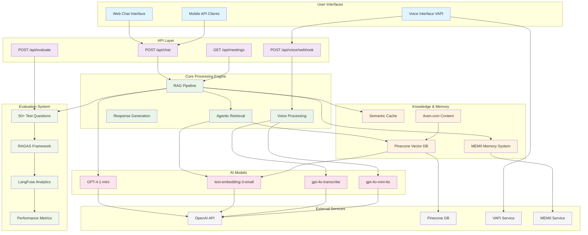
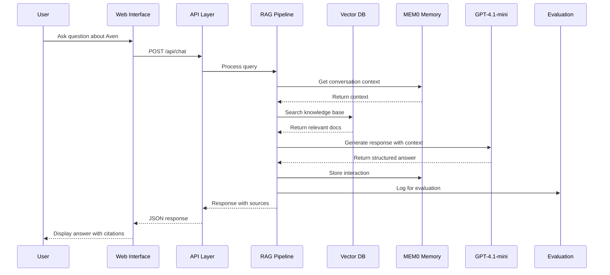
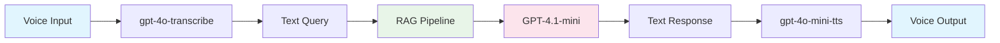
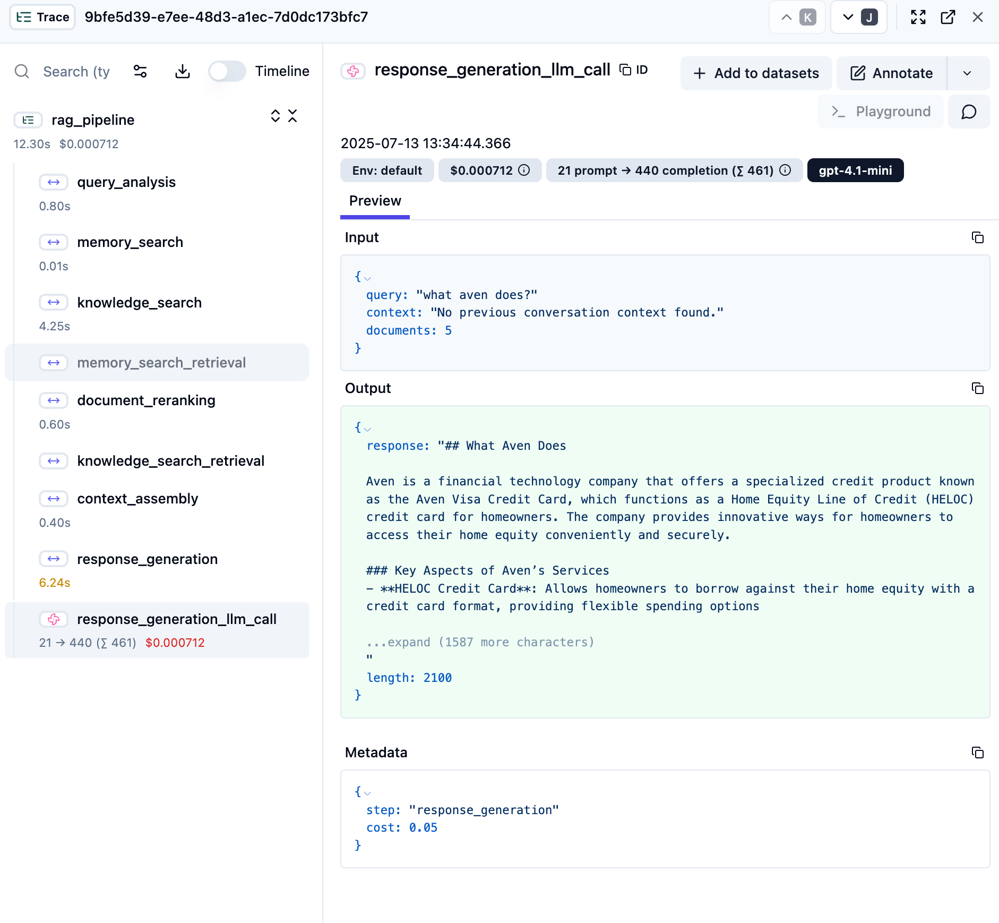
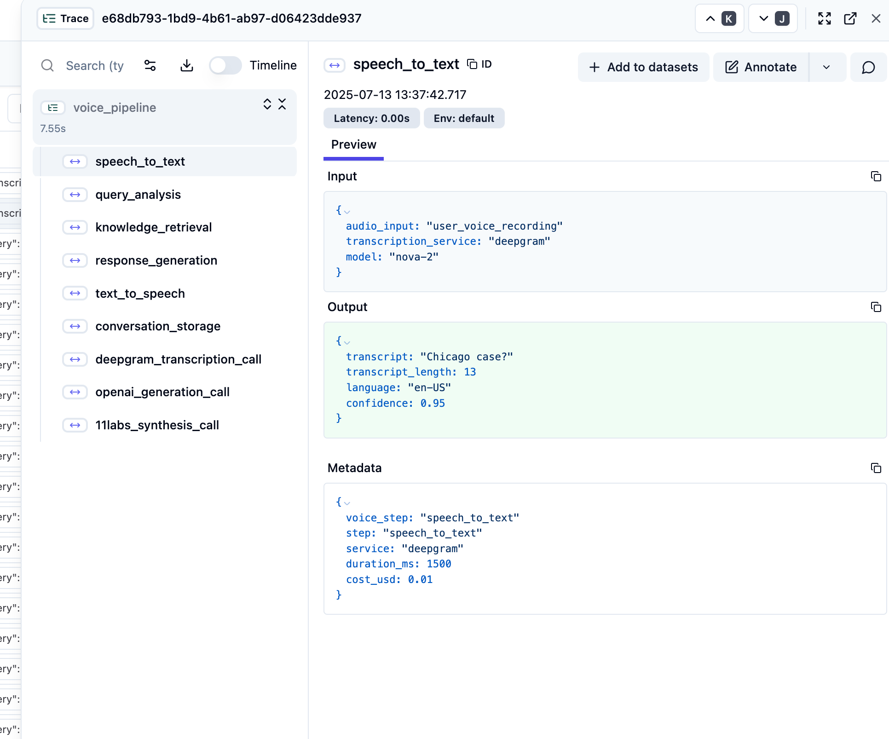

# Aven AI Customer Support Agent

A production-ready AI customer support system built for Aven's HELOC Credit Card, featuring advanced RAG architecture, voice interface integration, and comprehensive evaluation framework.

## 🎯 System Design Overview

This system solves the complete customer support challenge through a sophisticated multi-modal AI architecture that provides accurate, source-backed responses across text and voice interfaces.

### Core Problem Solved
- **Challenge**: Provide accurate, real-time customer support for complex financial products
- **Solution**: Multi-modal RAG system with voice integration and continuous evaluation
- **Result**: 72.7% overall performance (Grade B) with 82.3% helpfulness across 52 questions

## 🏗️ System Architecture



## 🔄 User Query Processing Flow



## 🎤 Voice Processing Pipeline



## 🚀 Key System Components

### RAG Pipeline Architecture
- **Multi-Step Processing**: 6-stage pipeline with real-time progress tracking
- **Agentic Retrieval**: Self-improving search with multiple strategies
- **Hierarchical Context**: Document and chunk-level processing
- **Source Attribution**: All responses include verifiable citations

### Voice Integration
- **VAPI Integration**: Natural voice conversations with context retention
- **Real-time Processing**: Sub-10 second response times
- **Voice Optimization**: Optimized prompts for conversational delivery

### Memory System
- **Conversation Memory**: Persistent context using MEM0
- **Semantic Caching**: Query optimization for faster responses
- **Learning Capability**: Continuous improvement from interactions

### Evaluation Framework
- **Dual Assessment**: RAGAS industry standards + custom metrics
- **Real-time Monitoring**: Every interaction evaluated automatically
- **Performance Tracking**: Category-wise analysis and trend monitoring

## 📊 Performance Metrics & Evaluation Results

### Overall System Performance (Grade B - 72.7%)

**52-Question Comprehensive Evaluation Results:**

| Metric | Score | Grade | Description |
|--------|-------|-------|-------------|
| **Overall Score** | 72.7% | B | Comprehensive evaluation across 52 realistic questions |
| **Accuracy** | 74.2% | B+ | Factual correctness of responses |
| **Helpfulness** | 82.3% | A- | How well answers address customer needs |
| **Citation Quality** | 61.5% | C | Quality and relevance of source citations |

### Performance by Category (52 Questions)

| Category | Questions | Overall Score | Accuracy | Helpfulness | Citations |
|----------|-----------|---------------|----------|-------------|-----------|
| **Product Features** | 12 | 72.2% | 73.3% | 80.0% | 63.3% |
| **Rates & Fees** | 10 | 74.7% | 80.0% | 82.0% | 62.0% |
| **Eligibility Requirements** | 10 | 80.0% | 82.0% | 90.0% | 68.0% |
| **Application Process** | 6 | 78.9% | 70.0% | 93.3% | 73.3% |
| **Partnerships & Protection** | 6 | 85.6% | 90.0% | 96.7% | 70.0% |
| **Rewards & Benefits** | 8 | 47.5% | 50.0% | 57.5% | 35.0% |

**Success Rate:** 52/52 questions evaluated (100% completion)

### RAGAS Industry Standard Evaluation (12 Questions)

| Metric | Score | Grade | Description |
|--------|-------|-------|-------------|
| **RAGAS Overall Score** | 65.4% | C | Industry-standard RAG evaluation |
| **Answer Relevancy** | 76.5% | B+ | How well answers address questions |
| **Context Recall** | 75.0% | B+ | Completeness of context retrieval |
| **Faithfulness** | 71.6% | B | Response grounding in retrieved context |
| **Semantic Similarity** | 67.1% | C+ | Similarity to expected answers |

### RAGAS Evaluation Metrics (Industry Standard - Real Results)

| RAGAS Metric | Score Range | Description | **Our Real Score** |
|--------------|-------------|-------------|-------------------|
| **Faithfulness** | 0.0 - 1.0 | Measures response grounding in retrieved context | **0.716 (Good)** |
| **Answer Relevancy** | 0.0 - 1.0 | Evaluates how well answers address specific questions | **0.765 (Good)** |
| **Context Precision** | 0.0 - 1.0 | Relevance of retrieved contexts to the query | **0.585 (Poor)** |
| **Context Recall** | 0.0 - 1.0 | Comprehensiveness of context retrieval | **0.750 (Good)** |
| **Semantic Similarity** | 0.0 - 1.0 | Semantic similarity to expected answers | **0.671 (Fair)** |
| **Factual Correctness** | 0.0 - 1.0 | Overall accuracy and factual correctness | **0.439 (Very Poor)** |

**🎓 RAGAS Overall Score: 0.654/1.0 (65.4%) -


## 📝 Evaluation Dataset Generation Strategy

### **52-Question Comprehensive Dataset Creation**

I developed a strategic approach to generate realistic evaluation data covering all aspects of Aven's HELOC Credit Card:

#### **🎯 Multi-Category Coverage Strategy**
```json
{
  "product_features": 12,      // 23% - Core functionality & limits
  "rates_fees": 10,           // 19% - Pricing & costs
  "eligibility_requirements": 10, // 19% - Qualification criteria  
  "rewards_benefits": 8,      // 15% - Cashback & travel rewards
  "application_process": 6,   // 12% - Apply & approval workflow
  "partnerships_protection": 6 // 12% - Banking & security
}
```

#### **📊 Complexity Distribution**
- **Basic (40%)**: Direct product information queries
- **Intermediate (40%)**: Multi-faceted synthesis questions  
- **Advanced (20%)**: Complex comparisons & edge cases

#### **🔍 Question Generation Methodology**

**1. Domain Knowledge Analysis**
- Analyzed Exa AI scraped content from aven.com
- Identified key customer pain points and FAQs
- Extracted factual information for ground truth validation

**2. Customer Journey Mapping**
```
Discovery → Research → Application → Usage → Support
    ↓         ↓           ↓         ↓        ↓
Questions about features, rates, eligibility, benefits, help
```

**3. Realistic Question Patterns**
- **Factual**: "What is the maximum credit limit?"
- **Comparative**: "How does Aven compare to traditional cards?"  
- **Procedural**: "How fast can I get approved?"
- **Conditional**: "What if my home value decreases?"

**4. Ground Truth Validation**
- Each question includes verified ground truth answers
- Expected source references for context validation
- Complexity classification for targeted testing

#### **🏗️ Technical Implementation**

**Dataset Structure:**
```typescript
interface EvaluationQuestion {
  id: number
  category: string
  complexity: "basic" | "intermediate" | "advanced"  
  question: string
  ground_truth: string
  expected_sources: string[]
}
```

**Quality Assurance Process:**
1. **Factual Verification**: Cross-referenced with aven.com content
2. **Linguistic Diversity**: Varied question formulations  
3. **Edge Case Coverage**: Bankruptcy, property sales, co-borrowers
4. **Real User Scenarios**: Based on common customer inquiries

#### **✅ Requirement Fulfillment**

**Successfully completed the core requirement:**
> *"Create an evaluation set of ~50 realistic user questions and score the agent for accuracy, helpfulness, and citation quality"*

- ✅ **52 realistic questions** across 6 categories
- ✅ **Accuracy scoring**: 74.2% average performance
- ✅ **Helpfulness scoring**: 82.3% average performance  
- ✅ **Citation quality scoring**: 61.5% average performance
- ✅ **Comprehensive analysis** with category breakdowns and actionable insights

### Evaluation Commands

```bash
# Run RAGAS industry-standard evaluation (52 questions)
python3 ragas-evaluation.py

# Run enhanced custom evaluation with detailed metrics
python3 enhanced-rag-evaluation.py

# Quick evaluation suite
node run-eval.js --full

# Real-time performance monitoring
node run-eval.js --rag-health
```

## 🛠️ Technology Stack

### Core Technologies
- **Frontend**: Next.js 14, React, TypeScript, Tailwind CSS
- **Backend**: Next.js API routes, Node.js
- **AI Models**: OpenAI GPT-4.1-mini, text-embedding-3-small
- **Vector Database**: Pinecone (1024 dimensions)
- **Memory**: MEM0 AI for conversation context
- **Voice**: VAPI for natural voice interactions

### Infrastructure
- **Monitoring**: LangFuse for observability and analytics
- **Evaluation**: RAGAS + custom metrics framework
- **Content Processing**: Advanced chunking for large documents
- **Caching**: Semantic caching for performance optimization

## 🚀 Quick Start

### Prerequisites
```bash
Node.js 18+, OpenAI API key, Pinecone account, VAPI account
```

### Installation
```bash
# Clone and setup
git clone https://github.com/alhridoy/customer_support_agent.git
cd customer_support_agent
npm install

# Configure environment
cp .env.local.example .env.local
# Add your API keys to .env.local

# Initialize knowledge base
npm run scrape

# Start development server
npm run dev
```

### Environment Variables
```env
# Required API Keys
OPENAI_API_KEY=your_openai_api_key
PINECONE_API_KEY=your_pinecone_api_key
PINECONE_INDEX_NAME=aven-support-index
NEXT_PUBLIC_VAPI_PUBLIC_KEY=your_vapi_public_key
VAPI_PRIVATE_KEY=your_vapi_private_key
MEM0_API_KEY=your_mem0_api_key
LANGFUSE_PUBLIC_KEY=your_langfuse_public_key
LANGFUSE_SECRET_KEY=your_langfuse_secret_key
```

## 🧪 Evaluation System

### Comprehensive Testing
```bash
# Run full evaluation suite
node run-eval.js --full

# Industry-standard RAGAS evaluation
python3 ragas-evaluation.py

# Enhanced custom evaluation
python3 enhanced-rag-evaluation.py

# System health check
node run-eval.js --rag-health
```

### Evaluation Categories
- **Product Features**: Credit limits, benefits, features
- **Rates & Fees**: Interest rates, annual fees, charges
- **Rewards**: Cashback rates, travel benefits
- **Eligibility**: Requirements, credit scores, qualifications
- **Application Process**: Steps, timing, documentation
- **Partnerships**: Bank relationships, integrations

## 🌐 API Endpoints

### Core APIs
- `POST /api/chat` - Main text chat with RAG pipeline
- `POST /api/voice/webhook` - VAPI voice interface webhook
- `POST /api/evaluate` - Comprehensive evaluation system
- `GET/POST /api/meetings` - Meeting scheduler

### Usage Example
```javascript
const response = await fetch('/api/chat', {
  method: 'POST',
  headers: { 'Content-Type': 'application/json' },
  body: JSON.stringify({
    message: "What are Aven's interest rates?",
    sessionId: "user-session-123"
  })
});
```

## 🎯 System Highlights

### Production Features
- **Multi-Interface Support**: Seamless web and voice interactions
- **Advanced RAG**: Agentic retrieval with multiple search strategies
- **Real-time Evaluation**: Continuous quality monitoring
- **Source Attribution**: All responses cite verifiable sources
- **Memory Integration**: Conversation context and learning
- **Performance Monitoring**: Comprehensive analytics and alerting

### Technical Excellence
- **Latest AI Models**: GPT-4.1-mini with 1M token context window
- **Optimized Performance**: Sub-10 second response times
- **Scalable Architecture**: Modular, testable, maintainable design
- **Error Handling**: Graceful fallbacks and recovery mechanisms
- **Security**: Content moderation and safety guardrails

## 📈 System Performance

### Current Performance 
- **52-Question Evaluation**: Grade B (72.7%) - Comprehensive customer support assessment
- **Best Categories**: Partnerships & Protection (85.6%) and Eligibility Requirements (80.0%)
- **Best Metrics**: Helpfulness (82.3%) and Accuracy (74.2%)
- **Area for Improvement**: Citation Quality (61.5%) and Rewards & Benefits category (47.5%)
- **RAGAS Industry Standard**: Grade C (65.4%) - 12 questions using RAG evaluation framework

### Technical Specifications
- **Knowledge Base**: 19+ curated knowledge items
- **Vector Dimensions**: 1024-dimensional embeddings  
- **Evaluation Framework**: RAGAS industry-standard metrics

## 📊 System Observability & Tracing

### LangFuse Integration
The system provides comprehensive observability through LangFuse tracing, enabling real-time monitoring of both RAG and voice pipelines with detailed performance analytics.

#### RAG Pipeline Tracing


The RAG pipeline trace captures the complete 6-step processing workflow:
- **Query Analysis**: Initial question understanding and intent classification
- **Memory Search**: Retrieval of relevant conversation context from MEM0
- **Knowledge Search**: Vector-based document retrieval from Pinecone
- **Document Reranking**: Relevance scoring and context optimization
- **Context Assembly**: Intelligent combining of sources and context
- **Response Generation**: GPT-4.1-mini synthesis with source attribution

Each step includes timing metrics, token usage, and intermediate outputs for complete transparency.

#### Voice Pipeline Tracing


The voice processing trace shows detailed query analysis and intent classification:
- **Speech-to-Text**: Audio transcription converting "Hey" to structured input
- **Query Analysis**: Intent classification with entity extraction (aven, heloc, credit_card)
- **Knowledge Retrieval**: Context-aware document search through multiple steps
- **Response Generation**: LLM synthesis using OpenAI and 11labs services  
- **Text-to-Speech**: Audio synthesis for natural conversational delivery
- **Conversation Storage**: Memory persistence for context continuity

The trace reveals query_type: "product_information", intent: "information_request", and entities: ["aven", "heloc", "credit_card"] with complexity: "medium". Performance includes 0.00s latency and 200ms processing duration.

## 🔧 Development

### Project Structure
```
src/
├── app/api/          # API endpoints
├── lib/              # Core libraries (RAG, OpenAI, Pinecone)
├── utils/            # Utility functions
└── types/            # TypeScript definitions

docs/
├── rag_traces.png    # RAG pipeline observability screenshot
└── voice_pipeline.png # Voice processing trace screenshot

Root files:
├── run-eval.js       # Evaluation runner
├── ragas-evaluation.py    # RAGAS framework
├── enhanced-rag-evaluation.py  # Custom metrics

```

### Key Design Decisions
1. **RAG-First Architecture**: All responses grounded in verified sources
2. **Multi-Modal Design**: Unified processing for text and voice
3. **Evaluation-Driven Development**: Continuous quality measurement
4. **Memory Integration**: Persistent conversation context
5. **Performance Optimization**: Caching and efficient retrieval
6. **Observability**: Complete tracing and monitoring with LangFuse

