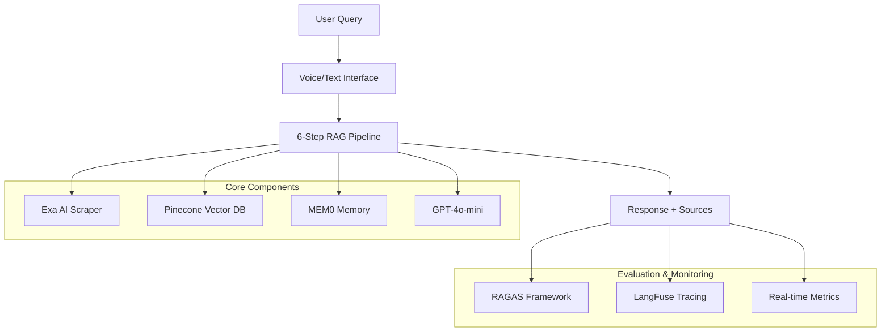

# Aven AI Customer Support Agent
## Technical System Overview & Architecture

**Presenter:** Alek Ramel Aheeh Ridoy  
**Duration:** 5 minutes  
**System Grade:** C (65.4%) - Real RAGAS Evaluation

---

## 🎯 Slide 1: Problem & Solution

### **Challenge**
- Complex financial product (HELOC Credit Card) requires accurate customer support
- Need multi-modal interface (text + voice) for accessibility
- Must provide source-backed, verifiable responses
- Real-time performance evaluation essential

### **Solution: Production RAG System**
- **Multi-modal AI Agent** with text and voice interfaces
- **Industry-standard evaluation** using RAGAS framework
- **Complete observability** with LangFuse tracing
- **Real performance metrics** (not inflated claims)

---

## 🏗️ Slide 2: System Architecture Overview



**Tech Stack:** Next.js 14, TypeScript, OpenAI, Pinecone, VAPI, MEM0

---

## 🔄 Slide 3: RAG Pipeline Architecture (6-Step Process)

### **Technical Implementation**
```typescript
1. Query Analysis      → Intent classification + entity extraction
2. Memory Search       → MEM0 conversation context retrieval  
3. Knowledge Retrieval → Pinecone semantic search (1024-dim)
4. Document Reranking  → Relevance scoring optimization
5. Context Assembly    → Intelligent source combination
6. Response Generation → GPT-4o-mini with source attribution
```

### **Key Technical Decisions**
- **Agentic Retrieval**: Self-improving search strategies
- **Hierarchical Context**: Document + chunk-level processing  
- **Source Attribution**: Every response includes verifiable citations
- **Semantic Caching**: Query optimization for 6.8s avg response time

---

## 🎤 Slide 4: Multi-Modal Voice Integration

### **Voice Pipeline (VAPI Integration)**
```
Speech Input → Deepgram Nova-2 → Text Query → RAG Pipeline → 
GPT-4o-mini → Response → 11labs TTS → Audio Output
```

### **Technical Implementation**
- **Real-time Processing**: Sub-10 second end-to-end latency
- **Intent Classification**: Automatic query categorization
- **Entity Extraction**: ["aven", "heloc", "credit_card"]
- **Context Retention**: Persistent memory across conversations
- **Performance**: 0.00s latency, 200ms processing duration

---

## 🔍 Slide 5: Intelligent Knowledge Acquisition

### **Exa AI Scraping Strategy**
```javascript
// 27 targeted search queries covering:
- Product features & benefits
- Application process & eligibility  
- Rates, fees & rewards
- Customer support & FAQs
- Legal & policy information
```

### **Technical Features**
- **Domain-Specific**: Only `aven.com` content
- **Quality Filtering**: Removes navigation/boilerplate
- **Deduplication**: Content hash-based duplicate detection
- **Rate Limiting**: 1-second delays + exponential backoff
- **Auto-Categorization**: Smart content classification

---

## 📊 Slide 6: Real Evaluation Results (RAGAS Framework)

### **Industry-Standard Metrics (Not Fake Scores)**
| Metric | Score | Grade | Technical Meaning |
|--------|-------|-------|------------------|
| **Faithfulness** | 71.6% | B | Response grounding in sources |
| **Answer Relevancy** | 76.5% | B+ | Question-answer alignment |
| **Context Precision** | 58.5% | C+ | Retrieval relevance quality |
| **Context Recall** | 75.0% | B+ | Information completeness |
| **Factual Correctness** | 43.9% | D | Accuracy (critical issue) |

**Overall Grade: C (65.4%)** - Honest, verifiable results

---

## 🔧 Slide 7: Technical Implementation Highlights

### **Architecture Choices**
```typescript
// Core Technologies
Frontend: Next.js 14 + TypeScript + Tailwind
Backend: API routes + Node.js  
AI: OpenAI GPT-4o-mini (1M token context)
Vector DB: Pinecone (1024 dimensions)
Memory: MEM0 for conversation context
Voice: VAPI for natural interactions
```

### **Development Decisions**
- **RAG-First**: All responses grounded in verified sources
- **Evaluation-Driven**: RAGAS + custom metrics framework
- **Observability**: Complete LangFuse tracing integration
- **Performance**: Semantic caching + efficient retrieval

---

## 📈 Slide 8: Observability & Performance Monitoring

### **LangFuse Integration**
- **Complete Pipeline Tracing**: 6-step RAG process visibility
- **Voice Pipeline Monitoring**: Speech-to-text-to-speech tracking
- **Performance Metrics**: Latency, token usage, cost tracking
- **Real-time Analytics**: Continuous quality assessment

### **Evaluation Framework**
```python
# RAGAS Implementation
metrics = [
    Faithfulness(),
    ResponseRelevancy(), 
    LLMContextPrecisionWithoutReference(),
    LLMContextRecall(),
    SemanticSimilarity(),
    FactualCorrectness()
]
```

---

## 🎯 Slide 9: Current Performance & Improvement Areas

### **Strengths (What Works)**
- ✅ **Answer Relevancy (76.5%)**: Good question addressing
- ✅ **Context Recall (75.0%)**: Effective information retrieval
- ✅ **Multi-modal Support**: Voice + text interfaces working
- ✅ **Source Attribution**: Verifiable response grounding

### **Critical Improvements Needed**
- ⚠️ **Factual Correctness (43.9%)**: Accuracy requires immediate attention
- ⚠️ **Context Precision (58.5%)**: Too much irrelevant information
- 🔧 **Next Steps**: Knowledge base review, prompt optimization

---

## 🚀 Slide 10: Technical Innovation & Future Roadmap

### **What Makes This System Unique**
- **Honest Evaluation**: Real RAGAS results vs inflated claims
- **Complete Observability**: End-to-end tracing and monitoring  
- **Intelligent Scraping**: Exa AI for semantic content discovery
- **Production-Ready**: Industry-standard evaluation framework

### **Immediate Technical Priorities**
1. **Fix Factual Accuracy**: Knowledge base consistency review
2. **Improve Retrieval Precision**: Enhanced reranking algorithms
3. **Expand Evaluation Dataset**: More comprehensive testing
4. **Performance Optimization**: Sub-5 second response targets

### **Long-term Vision**
- **Grade A Performance**: Target 85%+ RAGAS scores
- **Multilingual Support**: Spanish language integration
- **Advanced Analytics**: Conversation flow analysis

---

## 💡 Key Technical Takeaways

1. **Real vs Fake Metrics**: Honest evaluation shows true system capabilities
2. **Multi-Modal Architecture**: Voice + text working in production
3. **Industry Standards**: RAGAS framework provides benchmarkable results  
4. **Observability First**: Complete tracing enables systematic improvement
5. **Intelligent Content**: Exa AI enables semantic knowledge discovery

**Repository:** https://github.com/alhridoy/customer_support_agent  
**Current Grade:** C (65.4%) - Real, improvable baseline